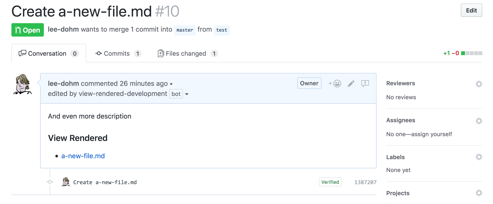

# View Rendered

> a GitHub App built with [probot](https://github.com/probot/probot) that appends a "View Rendered" set of links to PRs that include Markdown documents



## Setup

```sh
# Install dependencies
npm install

# Run the bot
npm start
```

See [docs/deploy.md](docs/deploy.md) if you would like to run your own instance of this app.

## License

[ISC](LICENSE.md)
